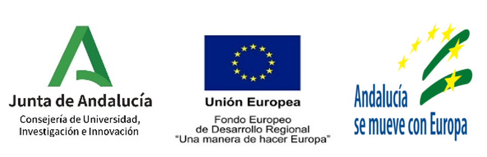

Investigador principal laboratorio de realidad virtual: Jesús Garrido Alcázar

El proyecto solicita financiación para cuatro líneas fundamentales de trabajo:
- Acondicionamiento de la Oficina Técnica, para ser capaz de asimilar y revisar todo el trabajo técnico desarrollado hasta el momento en el marco de los proyectos europeos relacionados con IFMIF-DONES así como desarrollar los primeros pasos necesarios para la gestión y organización de un proyecto de estas características. En estas fases iniciales, esta Oficina de Proyecto se centraría en los aspectos relacionados con la Integración de Proyecto (CAD, interfaces, requisitos, calidad, seguridad,) así como la gestión de contratos y aspectos legales relacionados.
- Desarrollo del Programa de investigación, formación y movilidad IFMIF-DONES en centros internacionales para los científicos e ingenieros que trabajarán en la futura instalación. Esta formación se realizará en centros de investigación y laboratorios internacionales destacados relacionados con la implantación de IFMIF- DONES.
- Creación del laboratorio de realidad virtual para tareas de manipulación remota en DONES, se pretende proporcionar la infraestructura necesaria y el conocimiento requerido para el correcto diseño, planificación, optimización y realización efectiva de las tareas de mantenimiento que requieran de manipulación remota en DONES. La creación de entornos virtuales de niveles de complejidad incremental permitirá validar y optimizar las tareas de manipulación diseñadas, proporcionar una herramienta de formación/entrenamiento del personal operador encargado de las tareas y establecer las bases para la existencia futura de un sistema de realidad mixta que facilite el control de la operación por parte del personal. Para ello, se plantea el desarrollo de un entorno virtual que permita simular las tareas de manipulación remota con los siguientes niveles de funcionalidad (y de complejidad) incrementales: (i) entorno de realidad virtual off-line capaz de generar secuencias y videos para validar las tareas de mantenimiento y, (ii) entorno de realidad virtual interactiva (on-line) que permitan al operador controlar el entorno virtual durante la simulación de la tarea.
- Creación del Laboratorio para el desarrollo de sistemas de control para LIPAc/DONES, el proyecto contempla varios planos de actuación. Por un lado, uno a corto plazo, orientado al soporte y ayuda a LIPAc. Gracias a trabajar con datos experimentales reales y a mantener la interfaz de control real, la integración de las mejoras y optimización de parámetros propuestas podrán ser integradas fácilmente en el acelerador. Por otro lado, el desarrollo de una herramienta de análisis de datos del acelerador. Y permitirá evaluar nuevos conceptos para DONES y realizar un análisis de alternativas y tecnologías a contemplar en el diseño de este nuevo instrumento. Finalmente, se plantea el desarrollo de tecnologías de comunicaciones convenientes para sacar provecho completo a las técnicas de simulación y optimización del control de aceleradores de partículas y que habrán sido validadas para LIPAc y estudiadas para su implementación en DONES. Esto permitirá dar una solución de optimización del control, detección de problemas de operación y mejora en la eficiencia
de la operación sin precedentes, gracias a un diseño del sistema compatible/dirigido desde su concepción, para sacar provecho de todas estas nuevas capacidades.

